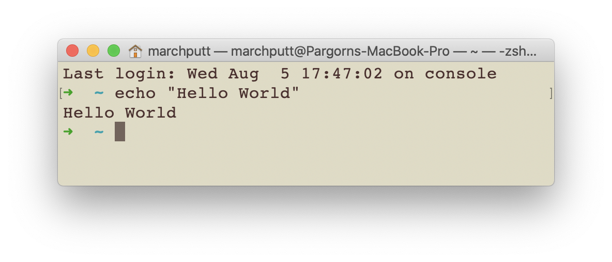

_เขียนโดย [ภากร พุทธาภิรัตน์](https://pargorn.puttapirat.com)_

# คำชี้แจง (Disclaimer)
*ใน tutorial นี้จะเป็นการนำเสนอการใช้งาน shell โดยอิงหนังสือ The Linux Command Line เขียนโดย William Shotts (internet edition ที่ 5) โดยสามารถ [download ได้](http://linuxcommand.org/tlcl.php) ภายใต้ลิขสิทธิ์แบบ Creative Commons จาก [linuxcommand.org](http://linuxcommand.org)*

---  
## บทนำ
สวัสดีครับ ในหน้า tutorial นี้ผมจะพาทุกคนมาเรียนรู้กับ shell ซึ่งเคยเป็นส่วนประกอบสำคัญในคอมพิวเตอร์ในสมัยที่ยังไม่มีระบบแสดงผลด้วยภาพ (graphic user interface; GUI) ส่วนสมัยที่เขาไม่มี GUI แล้วใช้คอมพิวเตอร์กันอย่างไรนั้นผมก็ไม่อาจทราบได้ชัดเพราะว่าผมเองก็เกิดไม่ทันครับ :laughing:   

Tutorial นี้ตั้งใจทำเป็นภาษาไทยเพื่อให้ผู้ที่สนใจการใช้งาน shell สามารถเข้าถึงเนื้อหาที่ถูกต้องและเที่ยงตรงได้มากขึ้น โดยผมเชื่อว่าจริงๆ แล้วทุกคนที่สนใจข้อมูลด้านนี้ก็สามารถอ่านภาษาอังกฤษได้เพียงแค่อาจจะยังไม่คล่องนัก ดังนั้นเราจะใช้ textbook ภาษาอังกฤษเล่มนี้ (The Linux Command Line เขียนโดย William Shotts) เป็นแกนหลักนะครับ :grin: >> [เหตุผลว่าทำไมถึงเลือกเล่มนี้](#ทำไมถึงใช้หนังสือ-the-linux-command-line)  

บทความนี้น่าจะเหมาะกับ นักวิทยาศาตร์ข้อมูล (data scientists) ผู้ที่สนใจจะพัฒนา/เขียนโปรแกรมช่วงเริ่มต้น ผู้ดูแลระบบ Linux และผู้ที่สนใจครับ

### เราจะเล่น shell กันไปทำไม
ก่อนจะลงทุนเวลาศึกษาเรื่องเกี่ยวกับ shell นี้ เราก็ต้องมาศึกษาว่ามันจะคุ้มค่าหรือไม่กับการศึกษาสิ่งนี้ใช่ไหมครับ ในส่วนนี้ผมจะอธิบายคร่าวๆ ว่าเราจะใช้ shell กันไปทำไมในเมื่อตั้งแต่เกิดมา เปิดคอมมาก็มี GUI สวยงามให้ใช้อยู่แล้ว :sunglasses: ตัวอย่างแรกที่นึกถึงได้ง่ายๆ ก็คือถ้าเราไปดูคอนเสิร์ตจะพบว่าคนคุมเสียงเขามีแผงควบคุมที่มีปุ่มเป็นร้อยๆ เรียงรายให้ปรับ คนคุมเสียงก็ถือเป็นผู้เชี่ยวชาญคนหนึ่ง เขาต้องมีการติดต่อ (interface) ร่วมกับระบบที่เขาใช้งานอยู่โดยเข้าให้ถึงทุกจุด ดังนั้นจึงต้องมีปุ่มไม่ว่าจะกด หมุน หรือเลื่อนขึ้นลงซ้ายขวามากมาย ถ้าเป็นคอมพิวเตอร์ตรงนี้เปรียบเป็นเหมือนกับการใช้งานผ่าน shell ... ย้อนกลับมาดูที่คนฟังดนตรีจากอุปกรณ์ที่เราใช้งานตามบ้าน พบว่ามีเพียงการเพิ่มลดเสียงเท่านั้นก็ฟังดนตรีได้อย่างสบายหู เหมือนกับ GUI ที่ออกแบบมาให้ใช้งานอย่างง่ายนั่นเอง

#### จริงๆ แล้วคำสั่งเชิงข้อความ text-based commands อยู่เบื้องหลัง GUI ทั้งหมด
ถ้าย้อนไปถึงตัวอย่างคนคุมเสียงในงานดนตรี คนคุมเสียงก็มีปุ่มสำหรับปรับความดังเสียงเหมือนกัน แต่นั่นเป็นเพียงปุ่มหนึ่งเท่านั้น แท้จริงแล้วภายใต้หน้าจอ (under the hood) โปรแกรมที่เราใช้งานกันอยู่ทุกวันนี้ก็คือคำสั่งที่เป็นข้อความมากมาย นำมาผูกกันไว้กับปุ่มที่เรากดนั่นเอง ใน tutorial นี้จะอธิบายตัวอย่างคำสั่งที่ทำได้ผ่าน shell และ GUI ทำให้เห็นภาพมากขึ้น

#### บางทีเราก็เข้าถึงจอภาพที่แสดง GUI ไม่ได้เสมอไป
เวลาเราเข้าถึงบริการต่างๆ ในระบบ cloud computing นั้นเป็นไปได้ยากมากที่จะทำการควบคุมเครื่องทางไกลผ่านโปรแกรมที่เห็นภาพอย่างเช่น Team Viewer หรือ Remote Desktop แต่ว่าเราจะต้องติดต่อคอมพิวเตอร์เหล่านั้นผ่าน secure shell (ssh) protocol นั่นหมายความว่า แค่สั่งย้ายไฟล์จากที่หนึ่งไปอีกที่หนึ่งก็ต้องใช้คำสั่งผ่าน shell เท่านั้น  

เหตุผลที่คนเราอยากไปใช้เครื่องใน cloud ก็มีหลายเหตุผลด้วยกัน เช่น data scientists อาจจะเข้าไปใช้คอมพิวเตอร์ที่ประมวลผลได้เร็วกว่า (เช่ามาชั่วคราว) ทำให้การคำนวนที่ต้องการทำได้เร็วขึ้น คนทำเว็บก็เข้าไปใน cloud เพื่อจะตั้ง web server เพื่อให้ผู้เข้าชมเว็บไซต์สามารถเข้าชมได้ตลอดเวลา เพราะว่า cloud server ไม่ต้องปิดเครื่องก็ได้ และนอกจากนี้ก็มีเหตุผลอีกมากมายที่ใครซักคนจะตกอยู่ในสถานการณ์ที่ต้องใช้งานผ่าน shell เท่านั้น

#### เข้าใจโครงสร้างคำสั่งที่เขาแชร์กันในเน็ต
เมื่อรันโปรแกรมแล้วพบกับปัญหา เราก็มันจะเอาข้อความผิดพลาด (error message) ไปแปะลง Google แล้วหาคนที่เจอปัญหาเดียวกัน จากนั้นก็นำคำสั่งที่เป็นคำตอบมารันในเครื่องของเรา หากเราไม่เข้าใจคำสั่งเหล่านั้นก็อาจทำให้เกิดข้อผิดพลาดอื่นๆ ตามมาอีกมากมาย :sweat_smile: ถ้าเราเข้าใจคำสั่งต่างๆ เราก็จะพัฒนาจากคนที่รันพอผ่านเป็นรันอย่างเข้าใจครับ :sunglasses:  

### อยากเล่น shell ต้องมีอะไรบ้าง
_คำตอบสั้น_: ไม่ว่าจะมีคอมพิวเตอร์แบบไหนก็หา shell มาใช้งานกันได้ แต่สำหรับบางคนอาจจะลง Linux เป็น virtual machine เพื่อความสบายใจเพิ่มไปอีกทีหนึ่ง  

การที่จะแสดงให้เห็นถึง shell มากที่สุดก็จะไม่พ้นการสาธิตด้วยระบบปฎิบัติการที่มีพื้นฐานมาจากระบบ Unix โดยปัจจุบันมีใช้กันอยู่อย่างแพร่หลายทั้งหมด 2 สาย คือ Linux (สมบูรณ์ที่สุด) และรองลงมาเป็น macOS โดยบางคำสั่งอาจจะไม่ครบถ้วนเหมือนกับใน Linux  

ส่วนใครที่ใช้ Windows ก็ยังไม่ต้องเสียใจไปว่าจะใช้ shell ไม่ได้เพราะว่าเดี่ยวนี้ Microsoft เขามีให้ความสำคัญกับงาน open source มากขึ้นและเกิดเป็นโครงการ [Windows Subsystem for Linux (WSL)](https://docs.microsoft.com/en-us/windows/wsl/install-win10){:target="_blank"} ที่ยกเครื่อง Linux มาเป็นระบบรองในระบบปฎิบัติการ Windows นั่นเอง เมื่อเป็นเช่นนั้นแล้วก็ทำให้เรามี Bash for Windows ([วิธีลงจาก itsfoss.com](https://itsfoss.com/install-bash-on-windows/)) ซึ่ง Bash ก็เป็น shell ที่โด่งดังตัวหนึ่งและหาใช้ได้ทั่วไปในทุกระบบปฎิบัติการ (cross-platform)  

## Table of Contents
- [ส่วนที่ 1: เรียนรู้การใช้งาน shell ](#ส่วนที่-1)
- ส่วนที่ 2: การปรับแต่งและสภาพแวดล้อม (environment)
- ส่วนที่ 3: งานและเครื่องมือทั่วไป
- ส่วนที่ 4: เขียนสคริปต์สำหรับ shell (shell script)
- ภาคผนวก
  - [ทำไมถึงใช้หนังสือ The Linux Command Line](#ทำไมถึงใช้หนังสือ-the-linux-command-line)

## ส่วนที่ 1
### Shell คืออะไร

### Navigation - การเปลี่ยนตำแหน่งปัจจุบัน

### สำรวจคอมพิวเตอร์

### เปลี่ยนแปลงไฟล์และโฟลเดอร์

### ใช้งานคำสั่งต่างๆ

### Redirection

### มองโลกอย่างที่ shell เห็น

### เคล็ดลับปุ่มลัด

### Permissions - การอนุญาตเข้าถึง

### Processes - ภาระกิจที่ทำอยู่

## ส่วนที่ 2

...

## ส่วนที่ 3

...

---

## ภาคผนวก

### ทำไมถึงใช้หนังสือ The Linux Command Line
เพราะว่า
- ผู้แต่งเขียนและปรับปรุงหนังสือเล่มนี้มานานมากๆ แล้ว เขาต้องเซียนมากๆ แน่ๆ เปิดมาอ่านคร่าวๆ แล้วก็วางไว้ลงเพราะว่าเขาอธิบายได้เข้าใจแจ่มแจ้งเสียจริงๆ
- หนังสือเล่มนี้ใช้ Creative Commons License ทำให้ใครๆ ก็โหลดไปอ่านได้อย่างอิสระ จึงเหมาะแก่การนี้เป็นอย่างยิ่ง
